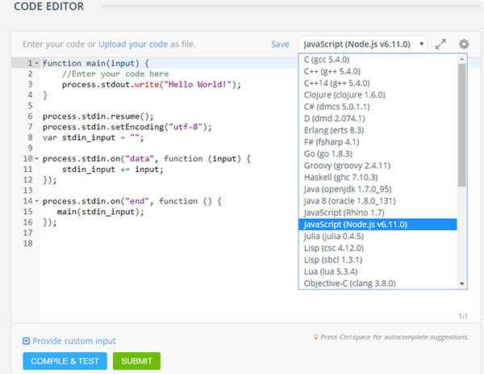

HackerEarth is one of the leading coding contest and challanges tool used by some of the major tech giants to recruit talent in India and abroad.
Basically heackerearth provides coding puzzles to programmers which they need to solve in limited time which can lead to some prizes and/or interviews with an organization.
The programming puzzles usually are algorithmic in nature and require reading from standard input (STDIN) and outputting to standard output.
There are a number of programming languages supported by HackerEarth platform, Javascript (using NodeJS) being one.

An example problem is like this: 

**Monk takes a walk:**
::: info 
https://www.hackerearth.com/practice/algorithms/searching/linear-search/practice-problems/algorithm/monk-takes-a-walk/
:::

If you are trying to solve the problems with Javascript (NODE envirnment), you would select the language of choice - Javascript (NodeJS) - like this:



This will display a basic skeleton program in your code editor:
```javascript  
function main(input) {
    //Enter your code here
    process.stdout.write("Hello World!");
}

process.stdin.resume();
process.stdin.setEncoding("utf-8");
var stdin_input = "";

process.stdin.on("data", function (input) {
    stdin_input += input;
});

process.stdin.on("end", function () {
   main(stdin_input);
});
```
However if you tried run this code on Windows command prompt; if will find that you can't end the program as `CTRL+D` doesn't work on CMD prompt. The problem is, the readline interface provided by Windows itself does not support `CTRL+D`. 

This is one of the ways to solve it,

Replace:
```javascript
process.stdin.on("end", function () {
   main(stdin_input);
});
```
With:
```javascript
process.on("SIGINT", function () {
   main(stdin_input);
   process.exit(0);
});
```
This will intercept `CTRL+C` keypress as the key-cobination invokes `_SIGINT_` event.

THAT'S IT!

Now you can process your input, store it in appropriate data structures and solve the actual problem.

## Key things to remember:

1. While processing inputs you need to remeber that DOS uses carriage return and line feed `("\r\n")` aka CLRF as line ending. So when you finally split std_input to process it, you need to split it based on `"\r\n"`. But when you submit code to HackerEarth, change that back to `'\n'`.

2. Before submitting the solution to HackerEarth, change `process.on("SIGINT",())` code section back to `_process.stdin.on("end", ())_`

## Final Submission:

Keeping these things in mind, the code for given `Monk takes a walk` problem will be something like this, which will run on Windows command line with Node JS:
```javascript

function main(input) {
    var lines = input.split('\r\n');
    var shift = lines.shift();
    lines.pop();
    treeCount(lines);
}

function treeCount(treeLine){
    var d_count=0;
    var temp;
    for(var i=0;i<treeLine.length;i++){
        d_count=0;
        for(var j = 0;j<treeLine[i].length;j++){
        temp = treeLine[i][j].toLowerCase();
        if(temp=='a' || temp=='e' || temp== 'i' || temp== 'o' || temp== 'u')
            d_count++;
        }
        console.log(d_count);
    }
}


process.stdin.resume();
process.stdin.setEncoding("utf-8");
var stdin_input = "";

process.stdin.on("data", function (input) {
    stdin_input += input;
});

process.on("SIGINT", function () {
   main(stdin_input);
   process.exit(0);
});

```

**But when we submit it back to HackerEarth as our solution it will need to be modified like this:**
```javascript
function main(input) {
    var lines = input.split('\n');
    lines.shift();
    //lines.pop();
    treeCount(lines);
}
 
function treeCount(treeLine){
    var d_count=0;
    var temp;
    for(var i=0;i<treeLine.length;i++){
        d_count=0;
        for(var j = 0;j<treeLine[i].length;j++){
        temp = treeLine[i][j].toLowerCase();
        if(temp=='a' || temp=='e' || temp== 'i' || temp== 'o' || temp== 'u')
            d_count++;
        }
        console.log(d_count);
    }
}
 
 
 
process.stdin.resume();
process.stdin.setEncoding("utf-8");
var stdin_input = "";
 
process.stdin.on("data", function (input) {
    stdin_input += input;
});
 
process.stdin.on("end", function () {
   main(stdin_input);
});
```

TADA! That's it.


## Read more... :coffee:

NodeJS readline interface: [NodeJS Readline](https://nodejs.org/api/readline.html) 


 
